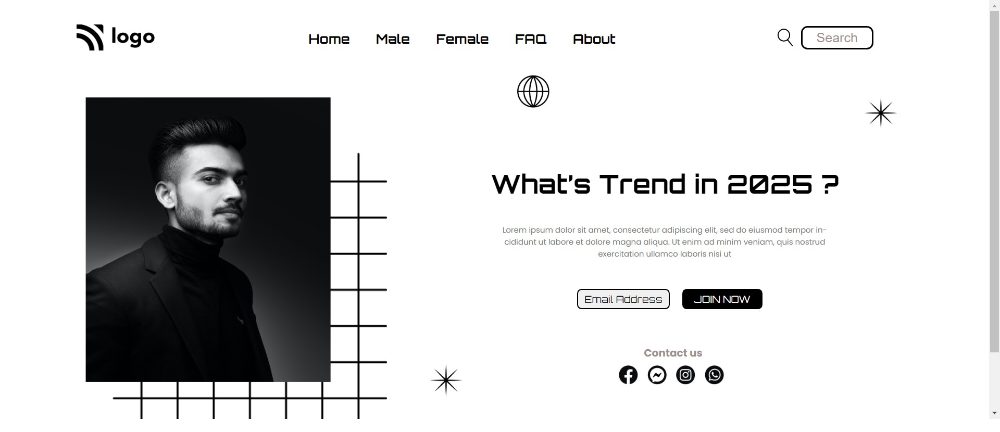

## 🔗Project 1 Link
https://htmlcssproject01.netlify.app/

## ⭐ Project-1: Street Style Landing Page⭐

This is a assignment given in **"JavaScript Full Stack Web Developer Bootcamp"** by **iNeuron**, built using **HTML5 and CSS3**.
 

 

## 📌 Tech Stack

&nbsp;
&nbsp;
 
 

## 📌 Overview

 

 "Template Screenshot")

## 📌 What I Learn
    👉 Structuring **HTML** and **CSS**
    👉 Flexbox 
    👉 Targeting nested elements and applying CSS on targeted items
    👉 Positions in CSS
    👉 CSS Selectors
    👉 Various properties like color, background-color, width, height and much more.
    👉 Applying different types of fonts with Google fonts
    👉 Margin and Paddings
    👉 Designing buttons

## Time taken to complete this project was **1 hr**.

## 📬 Connect With Me

- **LinkedIn** - [Pratyush Kesarwani](https://www.linkedin.com/in/pratyush-kesarwani-2b6601171/)

## 📌 Acknowledgments

- Course Instructor - [Hitesh Choudhary](https://github.com/hiteshchoudhary)
